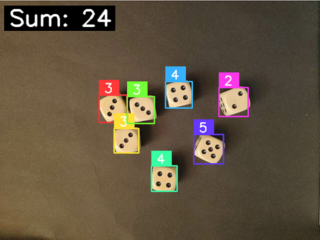
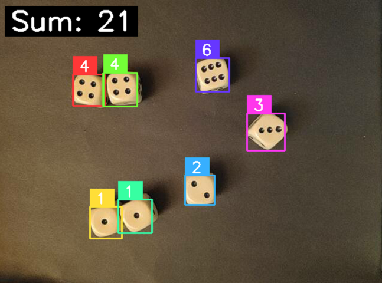

The aim of this project is to develop an algorithm which detects dice faces on a high contrasting background and count and sum up the pips.

---

The algorithm first uses opencv to preprocess the frames to get a binary image with black and white pixels. Afterwards, opencv's blob detection is used to detect the pips. If the goal were to only sum up the pips, this would already suffice, however the individual dice should be located and evaluated individually, therefore the pips are also changed in their colour, such that the dice faces are entirely filled in one colour.

To detect the individual dice, the watershed algorithm is applied on this new processed frame, detecting the individual clusters representing the dice. From this the bounding boxes are collected and processed to be given to an input into a neural network trained on GT dice images to detect the number of pips. Example images can be seen here:

Note on the training data:

The data has been collected by collecting frames with all dice only showing the respective number of pips and using the frame_processing function to separate the dice faces. This is done by the get_data script, taking these frames as input. Afterward, the data has to be filtered manually to avoid falsely identified faces.